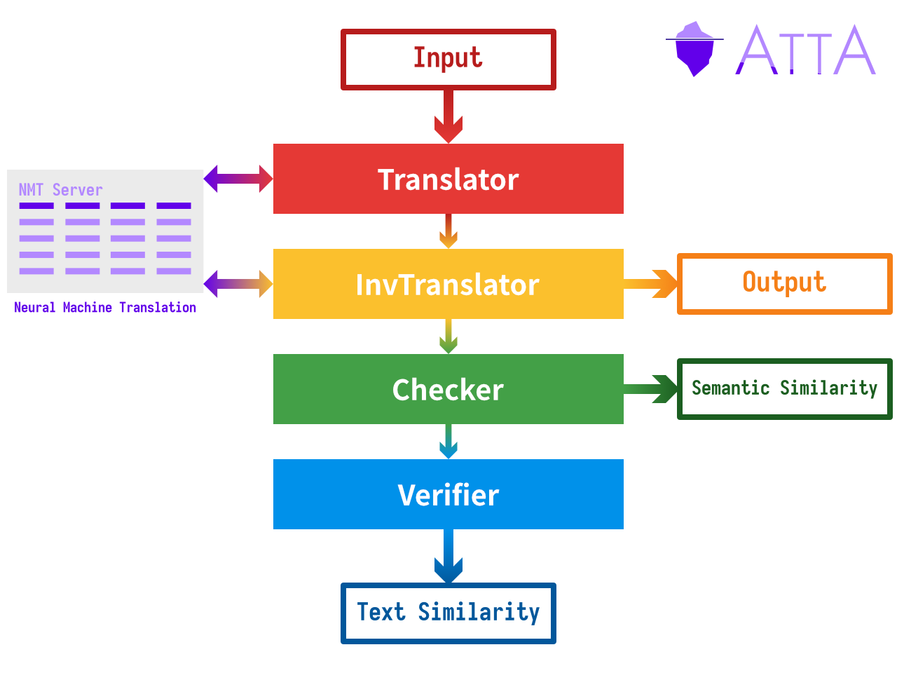
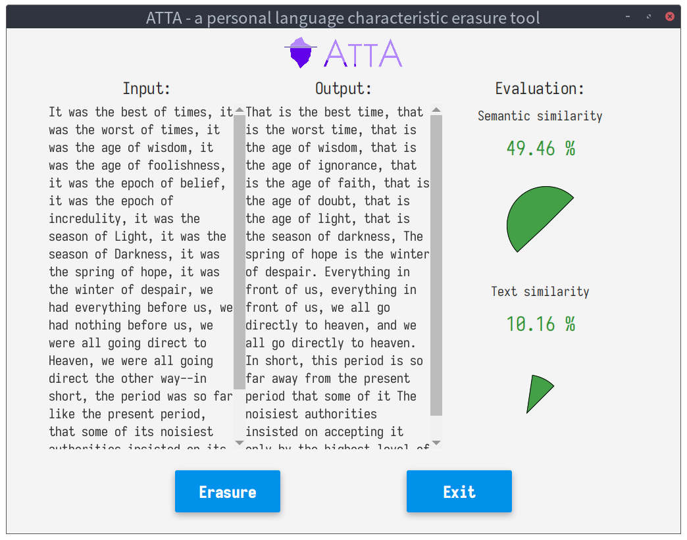

# atta


ATTA (AnTi Text Analysis) is a personal language characteristic erasure tool designed to resist big data text analysis.

## Build

* Install Java 11, Python 3, pip 3 and Maven

  ```bash
  sudo apt install openjdk-11-jdk python3 python3-pip maven
  ```

* Install Pycocoevalcap

  ```bash
  pip3 install -U pycocoevalcap
  ```

* Clone this repository

  ```bash
  git clone https://github.com/zyw271828/atta.git && cd atta
  ```

* Download & configure SPICE

  ```bash
  sudo apt install wget unzip
  ./config_spice.sh
  ```

* Update RAPIDAPI_KEY

  Visit [here](https://rapidapi.com/googlecloud/api/google-translate1/endpoints) to get an `x-rapidapi-key` (you may need to [register](https://rapidapi.com/signup) an account and [select](https://rapidapi.com/googlecloud/api/google-translate1/pricing) a free plan), and then use it to replace the `RAPIDAPI_KEY` in the [code](src/main/java/com/github/atta/Translator.java).

* Maven run

  ```bash
  mvn javafx:run
  ```

## Technical Details

<p align="center"></p>

## Screenshot

<p align="center"></p>

## License

ATTA is licensed under the MIT License.
